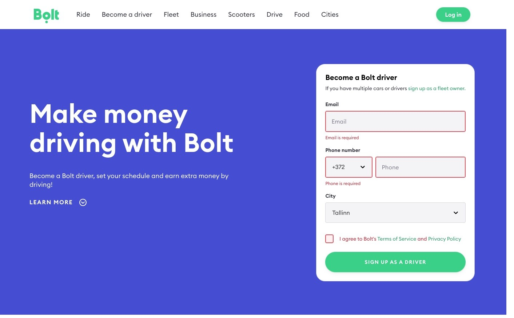

# Technical assignment

This is a technical assignment from Esoko Front-End Developer job application.

## Description

Your task is to implement a new driver landing page design. You can find the necessary information for the new layout in the attachments sections. We expect both desktop and mobile implementation of the design. Please use Bootstrap 4 to create a React app for the implementation

### Requirements and technologies to be used:

- Bootstrap 4
- React
- Typescript
- The task should be submitted as a git repository. (The repo should be private hosted on either GitHub or Bitbucket)

### Fonts and colors codes:

No particular font requirements. No particular font-size requirements. However the implementation should visually match the design.

- Background color: #4450d5
- Link color: #249e64
- Button color: #34d186
- No particular requirements for other colors

### Design

#### Desktop

#### Mobile

